# SABRE: Modeling-Resistant PUF Authentication for Networked Embedded Devices

> Artifact for the paper *"SABRE: Modeling-Resistant PUF Authentication for Networked Embedded Devices"*, submitted to IEEE CNS 2026.

Standard Arbiter PUFs (APUFs) are broken by machine learning in seconds. SABRE achieves **≤ 51.34% attack accuracy** — indistinguishable from random guessing — against the full suite of state-of-the-art modeling, reliability-based, and chosen-challenge attacks, while requiring only **2.73% LUTs** and **1.41% FFs** on a PYNQ-Z1 FPGA.

---

## Design Overview

SABRE combines four components into a single low-overhead FPGA authentication design:

1. **Public challenge transform** — a fixed binary matrix H maps the 32-bit external challenge to cₕ = Hc mod 2.
2. **Layer A internal signature** — 32 parallel 32-stage APUFs are driven by cₕ; three evaluations are bit-wise majority-voted to produce a device-specific internal signature s_maj that is never exposed through the authentication interface.
3. **Layer B 3-XOR response** — the internal challenge c′ = cₕ ⊕ s_maj drives three 32-stage APUFs whose outputs are XORed. The attacker can compute cₕ but cannot observe c′.
4. **BCH fuzzy extraction** — 7× temporal majority voting followed by BCH(31, 16, t=3) decoding stabilizes the response for reliable key reconstruction.

<p align="center">
  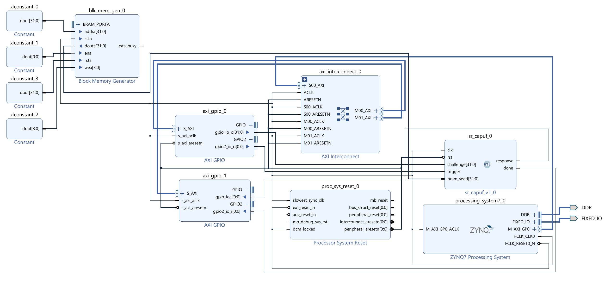
  <br><em>SABRE block design implemented on the PYNQ-Z1 FPGA</em>
</p>

<p align="center">
  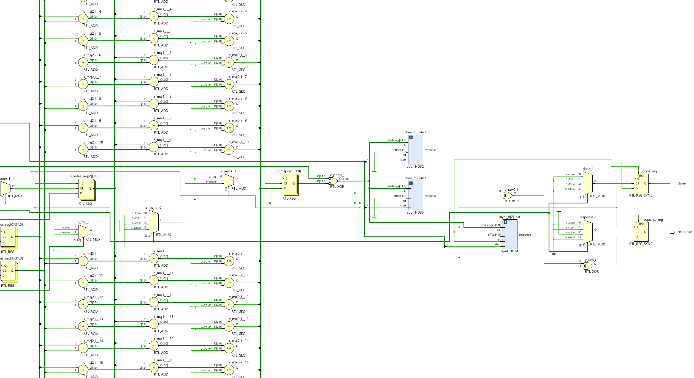
  <br><em>RTL design snippet showing the APUF switch-chain structure</em>
</p>

<p align="center">
  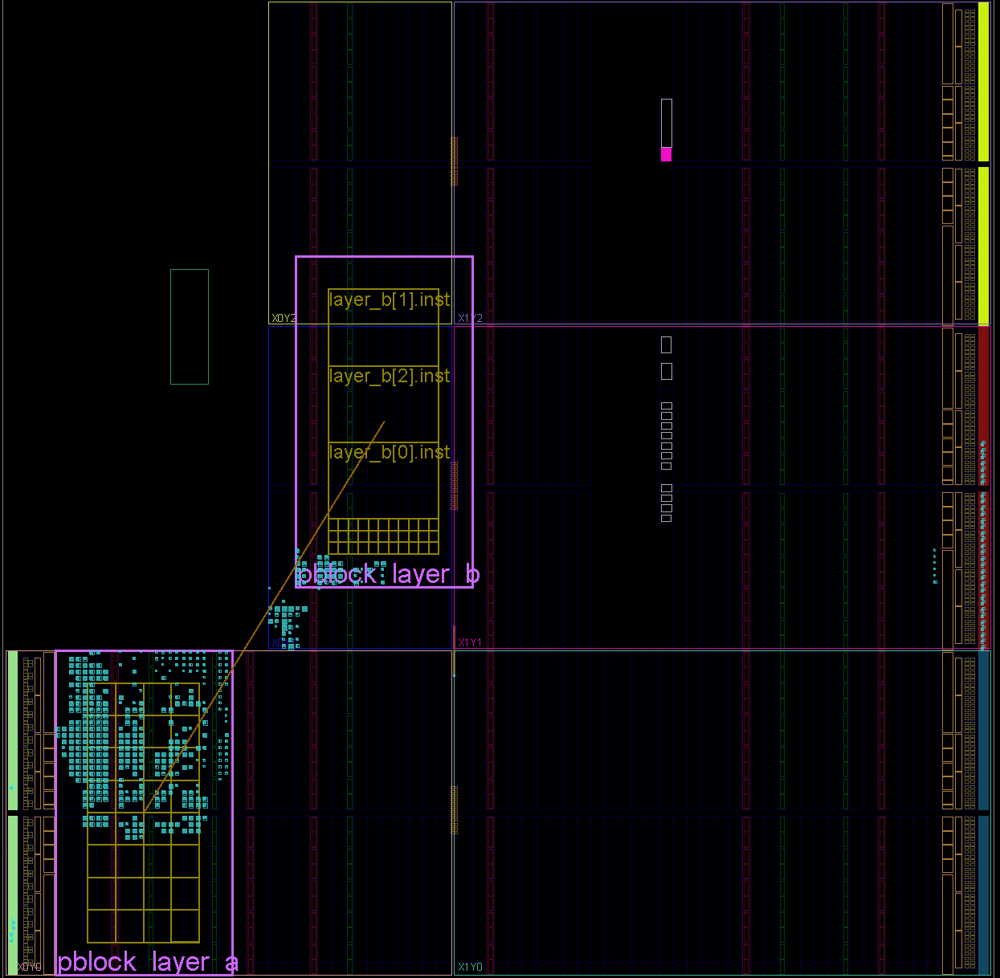
  <br><em>Implemented SABRE design on the PYNQ-Z1 board</em>
</p>

---

## Key Results

### Learning-Based Attacks on 1M Hardware CRPs (Table II)

| Attack | SABRE Test Acc. | Train Time | Reference |
|---|---|---|---|
| Logistic Regression | 0.5134 | 1.0 s | Rührmair et al., CCS 2010 |
| Polynomial LR (deg. 2) | 0.5094 | 12.7 s | Rührmair et al., CCS 2010 |
| DNN-Aseeri | 0.5134 | 118.3 s | Aseeri et al., 2024 |
| DNN-Mursi | 0.5134 | 81.6 s | Mursi et al., PST 2019 |
| CMA-ES (single-APUF) | 0.5127 | 63.0 s | Becker, CHES 2015 |

The same pipeline learns a 1-APUF baseline with **96.95%–99.70%** accuracy, confirming the attack code is correct.

### Overall Attack Comparison (Fig. 4)

<p align="center">
  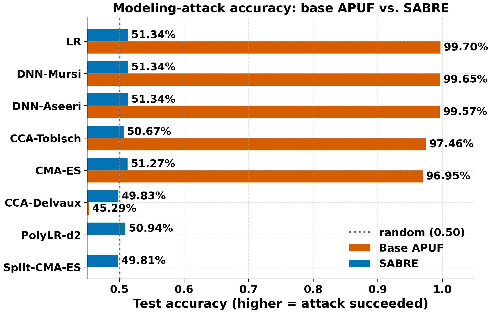
  <br><em>Fig. 4 — Modeling-attack accuracy: base APUF vs. SABRE. Attacks that learn the 1-APUF baseline with high accuracy still perform near-random guessing on SABRE.</em>
</p>

### DNN Training Curves (Figs. 5–6)

<p align="center">
  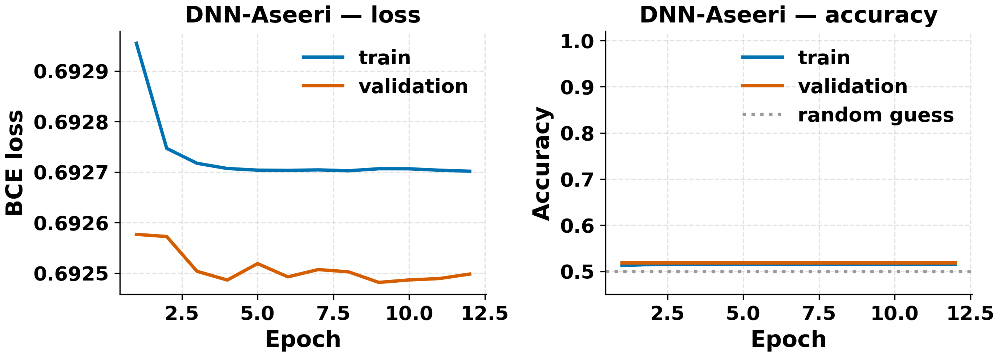
  <br><em>Fig. 5 — DNN-Aseeri training loss and validation accuracy on 1M SABRE hardware CRPs. Validation accuracy remains near random guessing throughout training.</em>
</p>

<p align="center">
  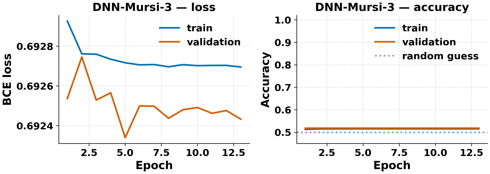
  <br><em>Fig. 6 — DNN-Mursi training loss and validation accuracy on 1M SABRE hardware CRPs.</em>
</p>

### CMA-ES Convergence (Fig. 7)

<p align="center">
  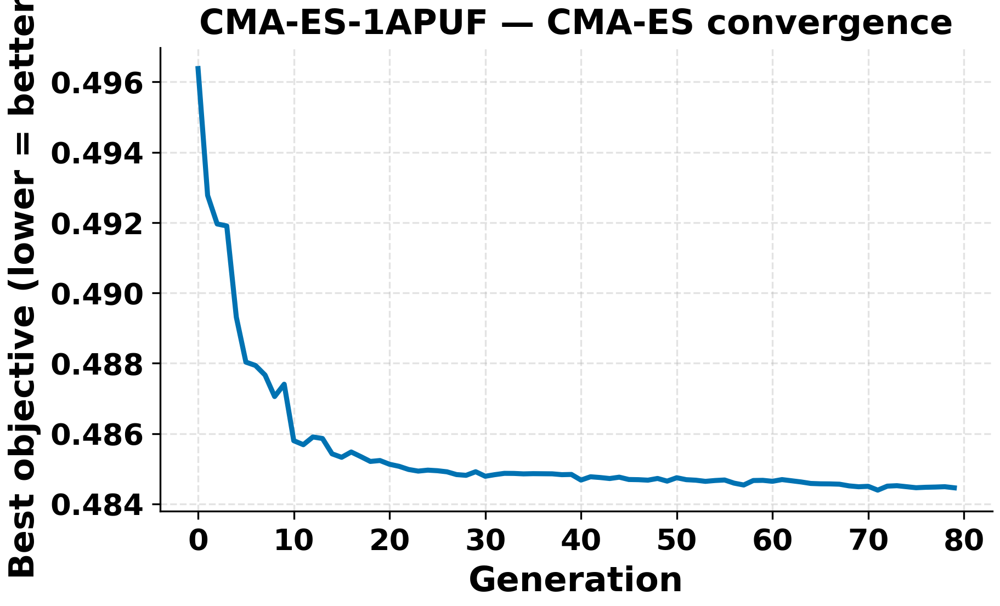
  <br><em>Fig. 7 — CMA-ES best-fitness trajectory on SABRE. The objective remains in the random-guessing region.</em>
</p>

### Reliability-Based and Chosen-Challenge Attacks (Table III)

Evaluated using simulator-based oracles that provide the stronger access these attacks require (not exposed by the deployed interface):

| Attack | Access Model | SABRE Acc. |
|---|---|---|
| Split-CMA-ES | Stabilized oracle | 0.4960 |
| Split-CMA-ES | Raw multi-read oracle | 0.4981 |
| Delvaux–Verbauwhede CCA | Adaptive oracle | 0.4983 |
| Tobisch low-HW CCA | Adaptive oracle | 0.5067 |

### Comparison with Hardened APUF Baselines (Table IV)

| Attack | 1-APUF | 4-XOR | 6-XOR | (1,5)-iPUF | SABRE |
|---|---|---|---|---|---|
| LR | 0.997 | 0.509 | 0.501 | 0.516 | 0.497 |
| DNN-Aseeri | 0.996 | 0.985 | 0.502 | 0.807 | 0.500 |
| DNN-Mursi | 0.997 | 0.985 | 0.500 | 0.787 | 0.499 |
| CMA-ES | 0.970 | — | — | — | 0.513 |


### Component Ablation (Fig. 10)

<p align="center">
  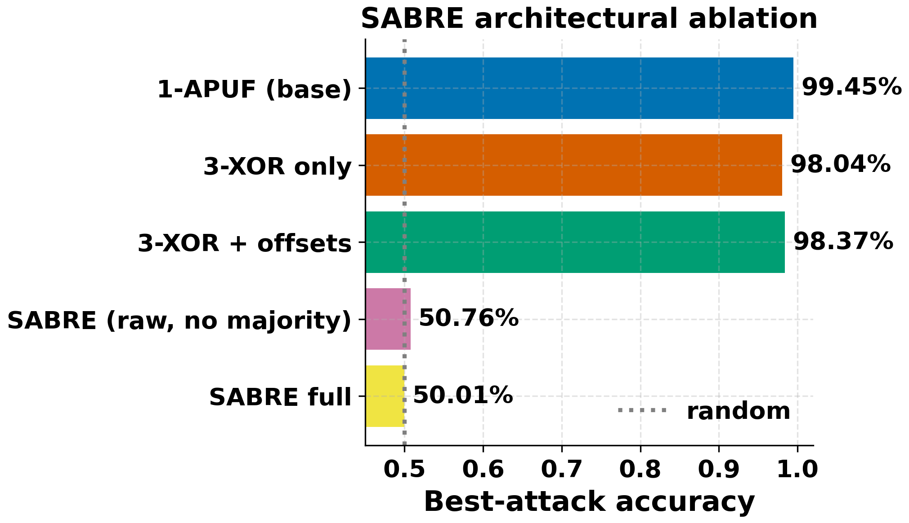
  <br><em>Fig. 10 — Ablation summary. The major drop in attack accuracy occurs when the device-specific Layer A signature is folded into the challenge driving Layer B.</em>
</p>

| Design Variant | DNN Test Accuracy |
|---|---|
| 1-APUF baseline | 0.9945 |
| 3-XOR only | 0.9804 |
| SABRE cascade, no final stabilization | 0.5076 |
| **SABRE full** | **0.5001** |

### PAC-Style Learnability Check (Fig. 8)

<p align="center">
  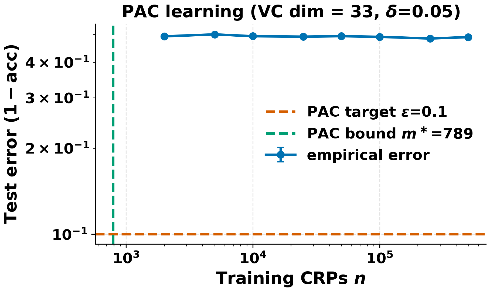
  <br><em>Fig. 8 — PAC-style learning curve. Empirical test error on SABRE remains above ε = 0.1 up to 5×10⁵ CRPs, well past the 1-APUF PAC bound m* ≈ 790.</em>
</p>

### CRP-Budget Scaling

<p align="center">
  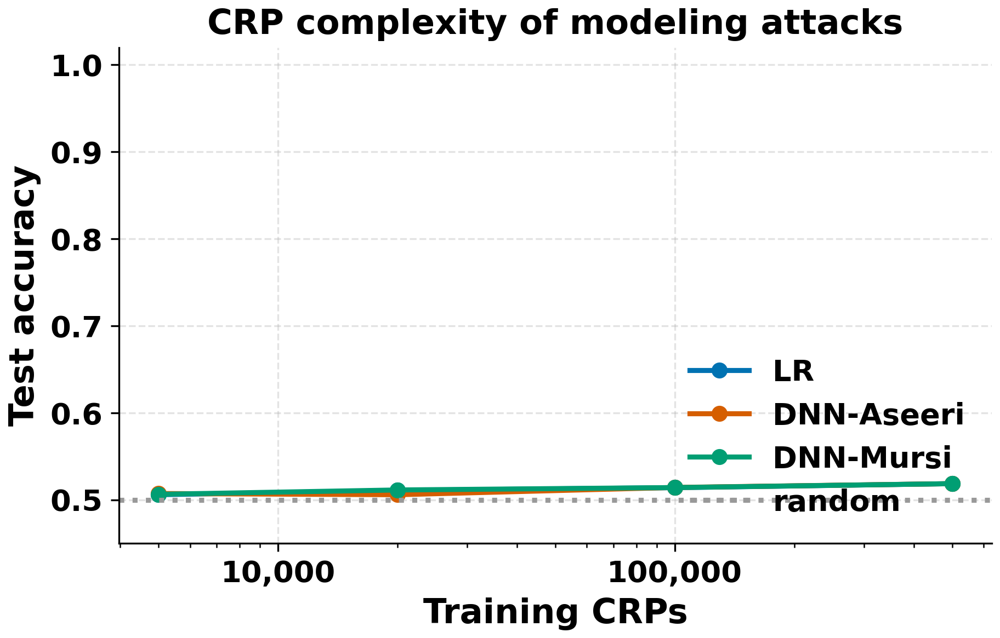
  <br><em>CRP-complexity sweep. Attack accuracy on SABRE remains near random guessing across all training set sizes.</em>
</p>

### FPGA Resource Utilization

<p align="center">
  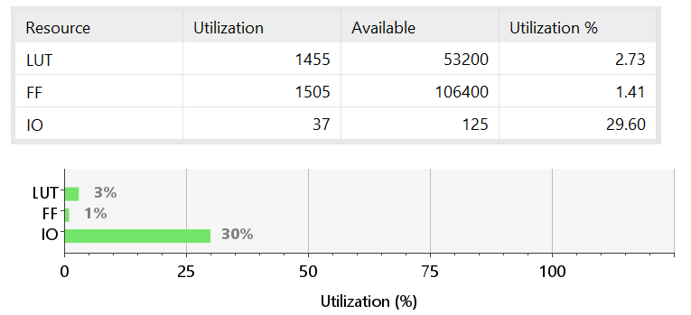
  <br><em>FPGA resource utilization on the PYNQ-Z1 — 2.73% LUTs, 1.41% FFs.</em>
</p>

<p align="center">
  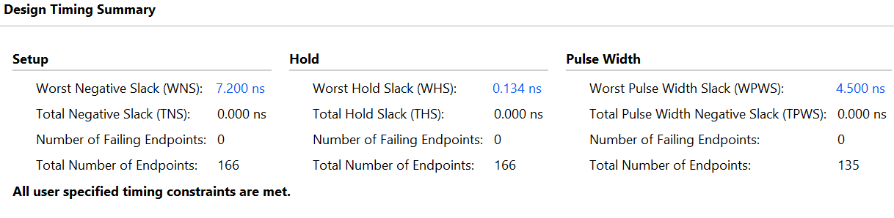
  <br><em>Vivado timing summary for the SABRE implementation.</em>
</p>

<p align="center">
  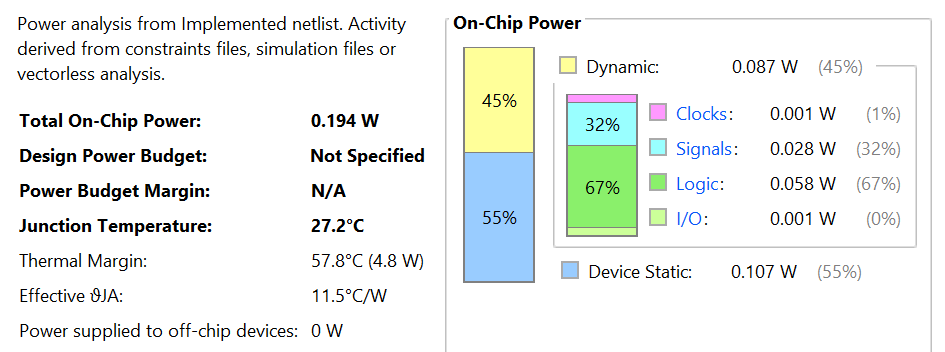
  <br><em>Vivado power estimate for the SABRE implementation.</em>
</p>

---

## Repository Layout

```
sabre-puf/
├── pc_side/                     # Host-side Python: attacks, evaluation, plotting
│   ├── attacks_suite.py         # LR, DNN-Aseeri, DNN-Mursi, CMA-ES, Split-CMA-ES
│   ├── cca_attacks.py           # Chosen-challenge attacks (Delvaux 2013, Tobisch 2021)
│   ├── simulators.py            # Calibrated APUF / XOR-APUF / iPUF / SABRE simulators
│   ├── run_full_evaluation.py   # End-to-end evaluation driver
│   ├── plotting.py              # Paper-quality figure generation
│   ├── metrics.py               # HD-intra, HD-inter, bit-bias, min-entropy
│   ├── make_phi.py              # Parity feature vector builder
│   ├── generate_crps.py         # Synthetic CRP generation utility
│   ├── verify_synthetic.py      # Self-test (no hardware required)
│   └── smoke_no_torch.py        # Lightweight smoke test without PyTorch
├── pynq_side/                   # Runs on the PYNQ-Z1 board
│   ├── sr_capuf_driver.py       # AXI overlay driver for the SABRE hardware core
│   └── collect_crps.py          # CRP collection CLI (sharded, with meta.json)
├── sim/
│   └── tb_sr_capuf.v            # Verilog-2001 behavioral testbench
├── verilog_fixes/               # Corrected RTL
│   ├── sr_capuf_fix2.v          # Done-handshake fix
│   └── sr_capuf_sync.v          # Clock-domain synchronization fix
├── xdc_fixes/
│   └── sr_capuf_constraints.xdc # Timing constraints
└── results/
    └── figures/                 # Paper figures (PNG + PDF, 300 DPI)
```

---

## Requirements

### PC side
```
python >= 3.10
numpy
scikit-learn
torch >= 2.0
matplotlib
pandas
```
```bash
pip install numpy scikit-learn torch matplotlib pandas
```

### PYNQ-Z1 board
- PYNQ v2.7 image with `pynq` Python package (pre-installed)

---

## Reproducing the Evaluation

### 1. Self-test (no hardware required)
```bash
cd pc_side
python verify_synthetic.py    # feature builder + metric checks
python smoke_no_torch.py      # lightweight metrics smoke test
```

### 2. Full attack suite (requires `CRPs_1M.csv` from hardware)
```bash
python run_full_evaluation.py --csv ../CRPs_1M.csv --out-dir ../results
```

Quick smoke run (20k CRPs):
```bash
python run_full_evaluation.py --csv ../CRPs_1M.csv --out-dir ../results --quick
```

Skip specific phases:
```bash
python run_full_evaluation.py --csv ../CRPs_1M.csv --out-dir ../results --skip cca,pac
```

### 3. Regenerate paper figures from a saved evaluation report
```bash
python regen_figs.py
# Writes results/figures/*.{png,pdf}
```

### 4. Collect CRPs from the PYNQ-Z1
```bash
# On the board:
python collect_crps.py --n 1000000 --repeats 11 --shard 100000 \
    --out /home/xilinx/crps_run1
# SCP the output directory to your PC, then pass to run_full_evaluation.py
```

---

## Citation

Anonymous submission. Citation information will be added after the review period.
